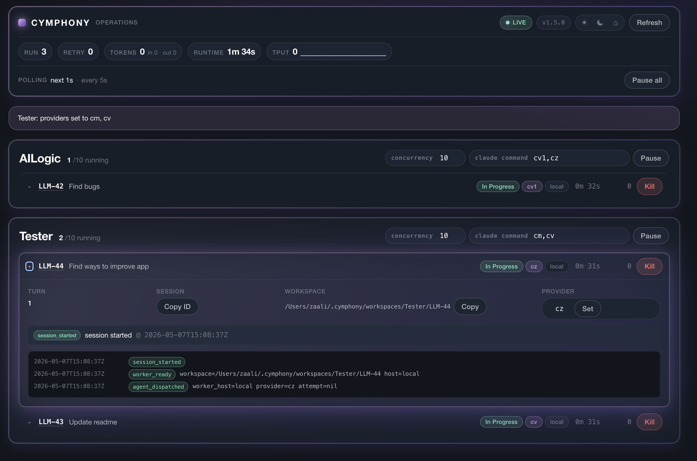
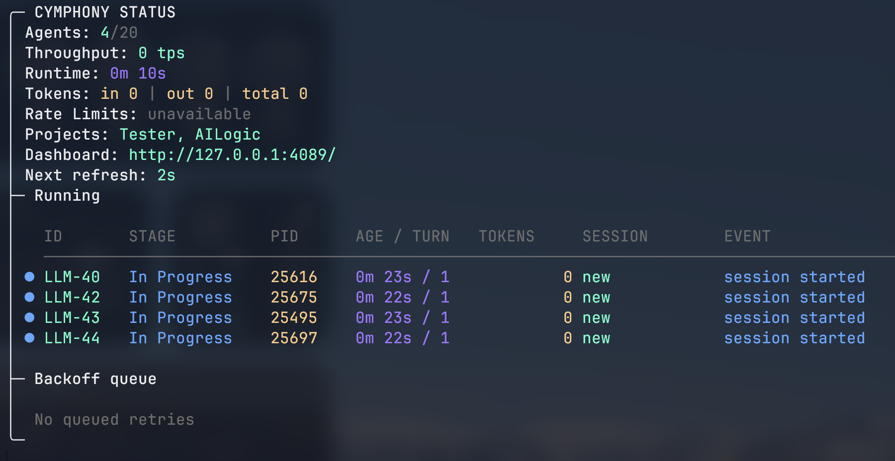

# Cymphony

> A modern rewrite of [openai/symphony](https://github.com/openai/symphony), using **Claude Code** instead of Codex.

Cymphony turns Linear tickets into autonomous coding sessions. Drop a ticket into "Todo" and Cymphony picks it up, spins up a sandboxed workspace, and lets Claude Code work on it until the issue closes. You manage **work**, not agents.

**Live web dashboard** — per-project sections, kill/retry/pause/set-provider per session, real-time activity:



**Terminal status** — same data, no browser, grouped by project:



---

## Why Cymphony?

If you've used [openai/symphony](https://github.com/openai/symphony), the core idea is the same. Cymphony adds the bits that turn it from a single-developer toy into something a small team can lean on:

| | openai/symphony | **Cymphony** |
|---|---|---|
| Coding agent | Codex | **Claude Code** |
| How you run it | clone the repo, run a Node server, keep it alive in a terminal tab | **One command from anywhere on your machine** — `cymphony` launches the orchestrator + dashboard; `cymphony start` runs it as a background daemon |
| Concurrency | one project, fixed | **Multi-project orchestration**, with a per-project cap on how many sessions may run at once (default 10, change live from the dashboard or CLI) |
| Claude command | one binary | **Custom Claude command per project** — point one project at the official `claude` CLI, another at a wrapper that swaps in z.ai / Kimi / OpenRouter credentials, etc. |
| Providers | one API endpoint | **Rotate across multiple Claude-compatible backends** — list two or more providers and Cymphony spreads new sessions across them randomly. Avoids hitting any single backend's rate limit. |
| Live UI | terminal-only | **Phoenix LiveView dashboard** with kill / retry / pause / set-provider per running session |
| HTTP API | — | `/api/v1/*` for state, pause, concurrency, providers, queue order/pin, refresh, Linear connect, add-project |
| Workspace lifecycle | clone-on-create | **after_create / before_run / after_run / before_remove hooks**, optional retention sweep |
| Setup | edit a YAML file | `cymphony setup` wizard, all config in `~/.cymphony/config.json` |
| Hot reload | restart | edit `WORKFLOW.md`, picked up next tick |
| Distribution | source build | **One-liner install** — `brew install zaalipro/cymphony/cymphony` (macOS) or grab the `.deb` on Ubuntu/Debian; Erlang is bundled, no system deps |
| Auth | — | optional `CYMPHONY_API_TOKEN` bearer auth on dashboard + API |

If you're already running `symphony`, switching is mostly: install `cymphony`, run `cymphony setup`, paste your Linear API key.

---

## Install

### macOS — Homebrew

```bash
brew tap zaalipro/cymphony

# Recommended: bundles Erlang/Elixir, zero system deps
brew install cymphony

# Or: smaller binary, uses your existing Homebrew Elixir/Erlang
brew install cymphony-lite
```

The two formulas conflict — pick one. To switch: `brew uninstall <one> && brew install <other>`. Your config and workspaces are untouched.

### Ubuntu / Debian

Cymphony needs the Anthropic `claude` CLI in your `$PATH`:

```bash
npm install -g @anthropic-ai/claude-code
# or follow https://docs.anthropic.com/en/docs/agents-and-tools/claude-code/overview
```

Then download the latest `.deb` from [GitHub Releases](https://github.com/zaalipro/cymphony/releases):

```bash
wget https://github.com/zaalipro/cymphony/releases/latest/download/cymphony_amd64.deb
sudo dpkg -i cymphony_amd64.deb
```

The `.deb` bundles the Erlang VM — no separate Elixir install required. Upgrade by re-running `dpkg -i` with a newer file. Uninstall with `sudo dpkg -r cymphony`.

### From source

If you'd rather build it yourself, see [Run from source](#run-from-source).

---

## First run

```bash
cymphony
```

The first time you run `cymphony`, it walks you through an interactive setup. Everything goes into `~/.cymphony/config.json`. You can re-run it any time with `cymphony setup`, or add another project with `cymphony add`.

Below is each step the wizard asks you, and exactly where to find the answer.

### Step 1 — Project name

```
Project name:
```

A nickname for this codebase. Just pick something memorable — `MyApp`, `Backend`, `WebStore`. You'll see this in the dashboard and in the CLI output. If you'll have multiple projects later, this is how you tell them apart.

### Step 2 — GitHub repo URL

```
GitHub repo URL (e.g. git@github.com:user/repo.git):
```

Cymphony clones a fresh copy of your repo into a workspace each time it picks up an issue, so it needs the clone URL.

**Where to find it:**

1. Open your repo on GitHub
2. Click the green **`< > Code`** button
3. Pick the **SSH** tab (recommended — uses your existing SSH key, no token to manage) and copy the URL

It looks like `git@github.com:your-org/your-repo.git`.

> If your machine isn't set up for SSH access yet, follow GitHub's [SSH setup guide](https://docs.github.com/en/authentication/connecting-to-github-with-ssh) — it takes about two minutes. The HTTPS URL also works (`https://github.com/your-org/your-repo.git`) but you'll then need a personal access token to clone private repos.

### Step 3 — Linear project slug

```
Linear project slug (e.g. myteam-ab12cd34ef56):
```

The slug is how Cymphony identifies your project inside Linear. It's part of the project's URL.

**Where to find it:**

1. Open Linear in your browser
2. Click into the **project** you want Cymphony to watch
3. Look at the URL bar — it'll look like:

   ```
   https://linear.app/your-team/project/myteam-ab12cd34ef56/issues
                                       ^^^^^^^^^^^^^^^^^^^^
                                       this is the slug
   ```
4. Copy that part (between `/project/` and `/issues`)

Alternatively, right-click the project in the sidebar and **Copy URL** — same slug, just trim it from the URL.

> Cymphony watches one project per entry. If you want to orchestrate multiple Linear projects, run the wizard again (`cymphony add`) and add a second one — they run side-by-side in the same daemon.

### Step 4 — Linear API key

```
Linear API key:
```

A personal API key that lets Cymphony read issues and post comments on your behalf. Cymphony uses it to poll the project, pick up "Todo" issues, and let Claude reply with progress comments.

**How to create one:**

1. Open Linear → click your avatar (top-right) → **Settings**
2. In the left sidebar: **Security & access**
3. Scroll to **Personal API keys**
4. Click **Create key**, give it a label like "Cymphony", and copy the value (starts with `lin_api_...`)
5. Paste it into the wizard

> The key is stored in plain text in `~/.cymphony/config.json` as top-level `linear_api_key` (and stamped onto every project). If you'd rather not have it on disk, set `LINEAR_API_KEY` in your environment instead — that env var is a **fallback only** when the file has no key, and the wizard offers it as a default when set. You can also paste the key later in the dashboard Settings drawer (Linear → Connect) without re-running the wizard.

### Step 5 — Workspace root  *(optional, has a default)*

```
Workspace root [~/.cymphony/workspaces/MyApp]:
```

Where Cymphony clones each issue's working copy. Press **Enter** to accept the default — `~/.cymphony/workspaces/<your-project-name>`. You'll usually only override this if your home is on a small disk and you want workspaces on an external drive.

### Step 6 — Polling interval *(optional)*

```
Polling interval in seconds [5]:
```

How often Cymphony checks Linear for new "Todo" issues. The default of 5 seconds is fine for almost everything. Press **Enter**.

### Step 7 — Coding agent *(optional)*

```
Coding agent (claude/codex/antigravity) [claude]:
```

Which coding agent runs this project's sessions: Claude Code (`claude`), Codex CLI (`codex`), or Antigravity CLI (`agy`). Press **Enter** for Claude Code. You can switch later with `cymphony agent antigravity` / `cymphony agent codex` or the per-project `agent` key in `~/.cymphony/config.json`.

### Step 8 — Add another project? *(optional)*

```
Add another project? [y/N]:
```

Press **Enter** to finish, or `y` to loop back to step 1 for a second project.

When the wizard exits you'll see:

```
Configuration saved to /Users/you/.cymphony/config.json
```

That's it. Run `cymphony` again to start the daemon.

---

## Running

Once configured, start the daemon and dashboard:

```bash
cymphony port 4089           # foreground, dashboard at http://localhost:4089
cymphony start               # background daemon
cymphony stop                # stop background daemon
cymphony restart             # bounce
cymphony logs 100            # tail the last 100 lines of the log
```

Without `port`, Cymphony runs without the web UI — useful for headless servers. With `port`, you get a real-time dashboard showing the Up next / Queue board, every running session, token usage, retry queue, rate limits, and per-project controls.

### The `port` flag

```bash
cymphony port 4089          # most common
cymphony port 8080          # use any free port
cymphony --port 4089        # long form, identical
```

Pick any port you have free. The dashboard is at `http://localhost:<port>/` and the JSON API is under `http://localhost:<port>/api/v1/`. By default the dashboard is **unauthenticated**, so don't expose it publicly without setting `CYMPHONY_API_TOKEN` (see [Auth](#auth-optional) below).

### Common commands

```bash
cymphony                                # run with saved config
cymphony project MyApp                  # run only the "MyApp" project
cymphony cr 3                           # cap concurrent sessions at 3
cymphony c cv1,cz2                      # rotate across providers cv1 and cz2
cymphony agent codex                    # run with the Codex CLI instead of Claude Code
cymphony agent antigravity              # run with the Antigravity CLI (`agy`)
cymphony model opus effort high         # model + reasoning effort passed to the agent CLI
cymphony port 4089                      # enable dashboard
cymphony project MyApp cr 5 c cv1,cz port 4089  # combine flags
cymphony start                          # run as a background daemon
cymphony stop                           # stop the background daemon
cymphony webui                          # open the dashboard in your browser
cymphony setup                          # re-run the wizard
cymphony add                            # add a new project to existing config
cymphony list                           # list configured projects
cymphony v                              # version
cymphony h                              # help
```

Long-form flags also work: `--project`, `--agent`, `--model`, `--effort`, `--concurrency`, `--provider`, `--port`, `--setup`, `--logs-root`, `--help`, `--version`.

### Per-issue overrides

Add Linear labels — `agent:codex`, `agent:antigravity`, `model:gpt-5.2-codex`,
`effort:high`, `provider:cz1` — or a directive line in the issue description:

```
cymphony: agent=codex model=gpt-5.2-codex effort=high
cymphony: agent=antigravity model=gemini-3.7-flash-high effort=high
```

Labels win over the directive; both win over project config. Changes apply on the
next dispatch/retry (running sessions keep their spec).


---

## Iterating with the agent

Cymphony isn't a one-shot dispatcher — you stay in the loop the same way you would with a human teammate.

Here's the natural flow:

1. You drop a ticket into your Linear "Todo" (or any active state). Cymphony picks it up on the next poll, spins up an isolated workspace, and the agent gets to work.
2. When it's done it pushes a branch, opens a **pull request**, and moves the ticket to "Done" (or whatever terminal state your workflow uses).
3. You review the PR. If something's off — wrong approach, missed edge case, code style nit, anything — **don't open another ticket**. Just **comment on the same Linear issue** describing what to change, then **move the ticket back to an active state** ("Todo", "In Progress", or "Rework").
4. On the next poll, Cymphony notices the ticket is active again and **resumes the same workspace and same branch**. The agent reads your new comment alongside the original ticket, applies your feedback, and force-pushes to the existing PR.
5. Repeat until you're happy and you merge it.

Because Cymphony reuses the workspace per-issue, the agent keeps full context across rounds — your comment lands on top of everything it already knows about the ticket, and you don't pay for a fresh re-read of the codebase every iteration.

---

## Multiple Claude providers

When you run a few sessions in parallel, the upstream API hits rate limits fast. Cymphony solves this by letting you spread sessions across multiple backends. For Claude, each provider is a different `ANTHROPIC_BASE_URL` + `ANTHROPIC_API_KEY` combo — Anthropic's official API, [z.ai](https://z.ai/) (GLM), [Kimi](https://kimi.com/) (Moonshot), [OpenRouter](https://openrouter.ai/), or any vendor that exposes an Anthropic-compatible API. Codex providers export `OPENAI_*` / `CODEX_*`. Antigravity providers export `ANTIGRAVITY_*` / `GOOGLE_*` / `GEMINI_*` (plus `API_TIMEOUT`; fallback keys `GOOGLE_API_KEY` / `GEMINI_API_KEY`).

You can configure providers two ways. **Pick whichever fits how you already work.**

### Option A — Shell functions (recommended for power users)

If you already manage API credentials in `.zshrc` or a private dotfiles repo, this is the most natural fit. Define a tiny shell function per provider — Cymphony picks them up automatically.

#### 1. Create `~/.cld`

A new file that holds your Cymphony provider functions, kept separate from your main shell config. Cymphony sources it before `.zshrc` so the functions are guaranteed to be visible.

```bash
touch ~/.cld
```

#### 2. Add a helper to clear stale env vars

Stick this at the top of `~/.cld` — every provider function calls it first to make sure leftover variables from a previous switch don't bleed in:

```bash
# ~/.cld

_unset() {
  unset ANTHROPIC_BASE_URL ANTHROPIC_API_KEY ANTHROPIC_MODEL ANTHROPIC_AUTH_TOKEN
  unset CLAUDE_CODE_DISABLE_NONESSENTIAL_TRAFFIC CLAUDE_CODE_USE_BEDROCK CLAUDE_CODE_USE_VERTEX
}
```

#### 3. Define one function per provider

The function name **must start with a lowercase `c`** (Cymphony's discovery rule), e.g. `cz`, `ck1`, `cv1`, `cm`. Each one clears the env, then exports the credentials for that backend.

```bash
# z.ai (GLM)
cz() {
  _unset
  export ANTHROPIC_BASE_URL="https://api.z.ai/api/anthropic"
  export ANTHROPIC_API_KEY="sk-zai-..."
  export ANTHROPIC_MODEL="glm-5.1"
}

# Kimi (Moonshot)
ck() {
  _unset
  export ANTHROPIC_BASE_URL="https://api.moonshot.ai/anthropic"
  export ANTHROPIC_API_KEY="sk-kimi-..."
  export ANTHROPIC_MODEL="kimi-k2.6"
}

# A second Anthropic key for parallel slots
cv1() {
  _unset
  export ANTHROPIC_API_KEY="sk-ant-..."
}

# Anthropic default (the bare claude binary)
cm() {
  _unset
  # uses the Claude Code subscription — no env vars needed
}
```

#### 4. Source `~/.cld` from your shell rc

Add this near the top of `~/.zshrc` (or `~/.bashrc`):

```bash
[ -f "$HOME/.cld" ] && source "$HOME/.cld"
```

Open a new terminal and `cz`, `ck`, `cv1`, etc. should all be defined as shell functions. You can run them by hand to manually switch credentials — `cz && claude -p "hello"` will route that single Claude call through z.ai.

#### 5. Use them in Cymphony

Now reference them by name:

```bash
cymphony c cz                  # all sessions use z.ai
cymphony c cv1,cz,ck           # rotate across three providers
cymphony project MyApp c cv1,cz   # rotate, but only for MyApp
```

Cymphony spawns each session in a sub-shell, sources your rc files, calls your function, captures the resulting env vars for the active agent (Claude: `ANTHROPIC_*` / `CLAUDE_CODE_*`; Codex: `OPENAI_*` / `CODEX_*`; Antigravity: `ANTIGRAVITY_*` / `GOOGLE_*` / `GEMINI_*` plus `API_TIMEOUT`; fallback keys `GOOGLE_API_KEY` / `GEMINI_API_KEY`), and hands them to the agent CLI. The result is cached so it's only resolved once per provider per daemon run.

### Option B — Config-based providers (simpler, no shell editing)

If you'd rather keep everything in one file and skip shell-function gymnastics, define providers directly in `~/.cymphony/config.json`:

```json
{
  "linear_api_key": "lin_api_...",
  "projects": [
    {
      "name": "MyApp",
      "github_repo_url": "git@github.com:you/myapp.git",
      "linear_project_slug": "myteam-ab12cd34ef56",
      "linear_api_key": "lin_api_...",
      "claude_command": "claude",
      "provider": "cz"
    }
  ],
  "providers": {
    "cz": {
      "ANTHROPIC_BASE_URL": "https://api.z.ai/api/anthropic",
      "ANTHROPIC_API_KEY": "sk-zai-...",
      "ANTHROPIC_MODEL": "glm-5.1"
    },
    "ck": {
      "ANTHROPIC_BASE_URL": "https://api.moonshot.ai/anthropic",
      "ANTHROPIC_API_KEY": "sk-kimi-...",
      "ANTHROPIC_MODEL": "kimi-k2.6"
    }
  }
}
```

Same usage from the CLI — `cymphony c cz`, `cymphony c cv1,cz` — Cymphony just reads the env vars from the JSON file instead of from a shell function.

### How rotation works

When you list multiple providers, Cymphony picks one **at random** for each new session — so 6 sessions across 3 providers averages roughly 2 each. There is no central **provider** queue: each dispatch independently samples the rotation. (Issue order is a different thing — the per-project **Up next** / Queue board.) If one backend goes down, only the sessions assigned to it fail (and retry with backoff).

You can change a project's provider list **at runtime** without restarting:

- **Dashboard**: in each project's section header, when the selected agent is `claude`, edit the `providers` input (e.g. `cv1,cz`) and press Enter. Persisted to `config.json`, applied to the next dispatch. The field is hidden for `codex` / `antigravity` / empty / unknown kinds; persisted providers are not deleted.
- **API**: `curl -X POST 'http://localhost:4089/api/v1/providers?project=MyApp' -d '{"value":"cv1,cz"}'`
- **Per-session live switch**: expand any running session row, type a provider in the per-session form, click **Set** — Cymphony kills that session and immediately re-dispatches it with the new provider.

### Per-project providers

Different projects can use different providers. Either edit `~/.cymphony/config.json` directly:

```json
"projects": [
  { "name": "Frontend", "providers": ["cv1", "cz"], ... },
  { "name": "Backend",  "providers": ["ck", "cm"], ... }
]
```

Or set them per-project from the dashboard's project header (the `providers` input is per-project — each project section has its own; the same header also carries agent/model/effort controls).

---

## Multi-project mode

Cymphony runs as many projects as you have configured, all in one daemon. Each project gets:

- its own poll loop against Linear (independent intervals)
- its own concurrency cap (set globally with `cr N`, or per-project via dashboard)
- its own provider list (set globally with `c ...`, or per-project)
- its own pause/resume toggle
- its own dashboard section with the **Up next** / Queue board, running sessions, and retry queue

Add a project after the fact:

```bash
cymphony add        # interactive — same wizard as setup, just for one new project
cymphony list       # show what's configured
```

Or add from the dashboard Settings drawer (Linear must be connected): pick a Linear project, name it, click **Add project**. The new project is written to `config.json`, a temp `WORKFLOW.md` is generated, and the orchestrator starts immediately — no daemon restart. CLI `setup` / `add` are unchanged.

Or run a single project on demand:

```bash
cymphony project Backend                   # only Backend, ignore the others this run
cymphony project Backend cr 5 c cv1,cz     # ...with a custom concurrency + provider list
```

---

## Web dashboard

Start with `cymphony port 4089`, open `http://localhost:4089`.

The dashboard opens in **Simple** mode: plain-language autonomy status, the active work queue, and the safety controls people use day to day. Switch to **Advanced** in the top bar to reveal model/provider configuration, token detail, workspace data, logs, and restart overrides. The choice is saved only in that browser and does not change orchestration behavior.

The dashboard shows:

- **Command bar (top)** — autonomy state plus working / waiting / usage / runtime counters in Simple mode; throughput, polling cadence, and rate limits in Advanced mode. Advanced adds a `.metric-pill--queue.section--queue` for `counts.waiting`; the simple Waiting pill stays `counts.retrying`.
- **Per-project sections** — one card per project with the project name, counts (`N/M running · Q queued · R retrying`), "tasks at once", and Pause/Resume. Advanced mode extracts labeled controls out of the cramped agent pill: `agent` (native `#agent-<project>` select), a `.model-switcher` Combobox (type-to-filter suggestions), `effort` (native `#effort-<project>` select), and `providers` (visible only when the selected kind is `claude`). Changing the kind persists immediately (kind only) and hides/shows the providers field on the next render. **Set** still saves kind + model + effort together. Both paths rewrite the project's generated `WORKFLOW.md` and overlay `config.json` so the select stays on the new kind after the next refresh.
- **Up next / Queue board** — `section.queue-board.section--board` **above** In Progress. Cards are dispatch-ready Linear issues that are not running (and not in the retry list). Hidden when `waiting` is empty. Drag permutes the sticky operator order (`reorder_queue`); Cymphony rank is the left-to-right then wrap index (`0` = next slot). Card **Edit** pins `agent_kind` / model / effort for the next dispatch (empty / keep skips; does not kill). Display pref `{Board, board}` hides the board (`html[data-hidden-sections~=board]`).
- **Compact session rows** — Linear ID, title, state, runtime, and Stop. Advanced mode adds provider, host, token, workspace, log, and restart details. Expanding a row shows a **Harness** pane (live CLI stdout, Follow/Paused) and a restart form that can pin `agent_kind` / provider / model / effort. Restart model is the same type-to-filter Combobox; the Provider field is Claude-only. Session provider chips stay visible for every kind.
- **Retry queue** — inline at the **bottom** of each project section (below In Progress; not on the board)
- **Recent completions** — global ring buffer of the last 100 finished sessions, collapsed by default in Simple mode
- **Settings drawer** — Experience mode, then **Linear** + **Projects**, then Automation / Display (including dashboard refresh seconds and the Board visibility checkbox). See below. Theme and drawer toggles are CSS geometry, not emoji.

Live updates are pushed via Phoenix Channels — no manual refresh.

### Settings drawer — Linear, add project, and refresh seconds

Open **Settings**. After Experience and before Automation (visible in Simple and Advanced):

1. **Linear** — paste a personal API key into the password field (`#linear-api-key`) and click **Connect** (`phx-submit="connect_linear"`, also `POST /api/v1/linear`). Status becomes **Connected** and shows a last-4 mask (`••••xxxx`). The key is stored in `~/.cymphony/config.json` as `linear_api_key` (file mode `0600`) and stamped onto every project. `LINEAR_API_KEY` is only a fallback when the file has no key. The raw key is never shown again in the UI, flashes, or API responses.
2. **Projects** — once connected, type-to-filter a Linear project from the `#add-project-slug` Combobox (not a native select), enter a Cymphony name, optionally a GitHub repo URL, and click **Add project** (`phx-submit="add_project"`, also `POST /api/v1/projects`). Advanced add-project fields include a model Combobox; `#add-project-provider` is visible only when the selected agent is `claude` (`preview_add_project`). The project is appended to `config.json`, a temp `WORKFLOW.md` is written, and the orchestrator starts immediately — no daemon restart. Duplicate name or Linear slug is rejected with a visible error.
3. **Automation / Orchestrator** — global Pause/Resume, global concurrency, and dashboard payload refresh (`#drawer-refresh-interval`, min 1, default 3 seconds). Submit (`set_refresh_interval`, also `POST /api/v1/refresh-interval`) persists top-level `dashboard_refresh_seconds` in `~/.cymphony/config.json`. This is **not** Linear polling (`polling.interval_ms` / `POST /api/v1/refresh`). Open dashboards keep their current interval until remount or a successful set.

Drawer inputs use class `settings-field`. CLI `cymphony setup` and `cymphony add` still work the same way.

### Auth (optional)

By default the dashboard and API are open to anyone with network access — `kill_issue` and `set_provider` work without authentication. To require a bearer token, set `CYMPHONY_API_TOKEN` before starting the daemon:

```bash
CYMPHONY_API_TOKEN=secret123 cymphony port 4089
```

- **API**: send `Authorization: Bearer secret123` on every request
- **Browser**: open `http://localhost:4089/?token=secret123` once — the token is stored in the session cookie and the URL is cleaned up via redirect

### API endpoints

All under `/api/v1/`:

| Method | Path | Description |
|---|---|---|
| `GET` | `/state` | full snapshot JSON (`waiting` + `counts.waiting` / `waiting_count`) |
| `GET` | `/linear` | Linear connect status: `connected`, `masked_key`, `source` (never the raw key) |
| `POST` | `/linear` | body `{"api_key":"..."}` — validate + persist `linear_api_key`; `202` status or `422` |
| `GET` | `/linear/projects` | accessible Linear projects `{id,name,slug_id}` (`422` if not connected) |
| `GET` | `/projects` | one-line summary per project (running/retrying counts) |
| `POST` | `/projects` | add + start a project (no daemon restart); `202` `{name,linear_project_slug,started}` |
| `GET` | `/<issue_identifier>` | one running session's details |
| `GET` | `/<issue_identifier>/harness` | live CLI stdout ring (`HarnessStream` snapshot) |
| `POST` | `/refresh` | force a Linear poll right now |
| `POST` | `/refresh-interval` | body `{"value": N}` — persist `dashboard_refresh_seconds`; `202` or `422` `invalid_refresh_interval`. **Not** `POST /refresh`. Declared before `/<issue_identifier>`. |
| `POST` | `/pause` `?project=Name` | stop dispatching new issues |
| `POST` | `/resume` `?project=Name` | resume |
| `POST` | `/concurrency` `?project=Name` | body `{"value": 5}` |
| `POST` | `/providers` `?project=Name` | body `{"value": "cv1,cz"}` |
| `POST` | `/agent` `?project=Name` | body `{"kind","model","effort"}` — persist + rewrite project `WORKFLOW.md` so `agent_kind` survives refresh |
| `POST` | `/queue` `?project=Name` | body `{"order":["LLM-51","LLM-12"]}` — persist sticky waiting order; `202` `{order,project}` or `422` `invalid_queue_order`. **Required** `?project=`. Declared before `/<issue_identifier>`. |
| `POST` | `/queue-pin` `?project=Name` | body `{"issue":"LLM-51","kind","model","effort"}` — pin agent/model/effort for the next waiting dispatch (empty/`keep` skipped; at least one field); `202` or `422` `invalid_queue_pin`. Does not kill. No Linear writes. Declared before `/<issue_identifier>`. |
| `GET` | `/completed` `?limit=N` | recent completions ring buffer |

`/linear`, `/linear/projects`, `POST /projects`, `POST /api/v1/queue`, `POST /api/v1/queue-pin`, and `POST /refresh-interval` are declared before `/<issue_identifier>`. Unsupported methods on those routes return `405`. `POST /linear` never echoes `api_key`.

---

## Run from source

We use [mise](https://mise.jdx.dev/) to manage Elixir/Erlang versions:

```bash
git clone https://github.com/zaalipro/cymphony
cd cymphony
mise trust && mise install
mix setup
make build
./bin/cymphony port 4089
```

Or ask your favorite agent:

> Set up Cymphony for my repo using https://github.com/zaalipro/cymphony/blob/main/README.md

### Tests

```bash
make all    # full CI gate: build, fmt, lint, coverage, dialyzer
make test   # ExUnit only
```

The live end-to-end test creates real Linear issues and runs an actual Claude Code session — gated behind `make e2e` and an env var:

```bash
export LINEAR_API_KEY=...
make e2e
```

---

## How it works

```
Linear  ──poll──>  Cymphony  ──spawn──>  Workspace  ──exec──>  Claude Code
   ^                  │                       │                     │
   │                  │                       │                     │
   └──── close ───────┴── status ───────── result ───── tool ───────┘
```

1. **Poll** — every 5 seconds, Cymphony fetches each project's "Todo" issues from Linear
2. **Dispatch** — after `Queue.reconcile`, the next free slot starts the **leftmost** waiting card (sticky operator order; `Dispatch.sort_for_dispatch` is initial order only). Cymphony picks a provider (random from the rotation list) and spawns an `AgentRunner` task
3. **Workspace** — the runner creates a fresh per-issue directory, runs your `after_create` hook (e.g. `git clone`), then your `before_run` hook
4. **Agent** — the runner launches Claude Code with the workflow prompt as the user message, streams stdout, parses tool-use events, and updates the dashboard live
5. **Termination** — when the issue moves to `Done`, `Closed`, `Cancelled`, or `Duplicate`, Cymphony kills the agent and runs `before_remove` + `after_run` hooks
6. **Retry** — if the agent crashes or times out, the issue goes into the retry queue with exponential backoff

Per-issue workspaces are persistent across runs (deterministic re-runs), and there's an optional retention sweep that deletes idle workspaces after N days:

```yaml
# WORKFLOW.md
workspace:
  root: ~/code/workspaces
  retention_days: 14
```

---

## Architecture

```
CymphonyElixir.Supervisor (one_for_one)
├── Phoenix.PubSub
├── HarnessStream (ETS ring of live CLI stdout)
├── Registry (ProjectRegistry)
├── Task.Supervisor (AgentRunner tasks)
├── DynamicSupervisor (ProjectDynamicSupervisor)
│   └── ProjectSupervisor (one per project)
│       ├── WorkflowStore   ──── hot-reloads WORKFLOW.md
│       └── Orchestrator    ──── poll loop, dispatch, retry, snapshot
├── HttpServer (Bandit + Phoenix LiveView)
└── StatusDashboard (terminal)
```

Layered:

- **CLI** (`cli.ex`) — flag parsing, multi-project entry point, background daemon controls
- **Config** (`cymphony/config.ex`) — reads `~/.cymphony/config.json`, generates per-project `WORKFLOW.md` in `tmp/`, writes runtime updates back
- **Workflow store** (`workflow_store.ex`) — owns the parsed workflow per project, supports hot reload
- **Orchestrator** (`orchestrator.ex`) — heart of the dispatch loop, holds `running:`, `waiting:`, and `retrying:`, enforces concurrency, picks providers, surfaces snapshots
- **Agent runner** (`agent_runner.ex`) — per-task process, runs lifecycle hooks, calls `Claude.AppServer`
- **Shell provider** (`cymphony/shell_provider.ex`) — sources `~/.cld` / `.zshrc` / `.bashrc` in a zsh subprocess to resolve `cz`, `cv1`, etc. into env-var maps; cached in `:persistent_term`
- **Workspace** (`workspace.ex`) — path-safety validation, lifecycle hooks, optional SSH worker, retention sweep
- **Tracker** (`tracker.ex`) — adapter behaviour; `Linear.Adapter` is the production impl, `Tracker.Memory` for tests

If you want to port the design somewhere else, [`SPEC.md`](SPEC.md) is the source of truth.

---

## FAQ

**Q. Why Elixir?**
BEAM/OTP is built for supervising thousands of long-running processes that occasionally crash. That's exactly the workload — every agent is its own task, isolated from the others. Hot-code reload during development is a bonus.

**Q. Can I use it with my Anthropic Claude Code subscription?**
Yes. Use the bare `claude` command (no provider override) and it goes through your subscription credentials. Use a provider only when you want to route around rate limits.

**Q. Will it work with a different issue tracker?**
The tracker layer is behaviour-based (`tracker.ex`). Linear is the only built-in adapter, but the surface is small — implement `list_issues/2`, `update_state/3`, `add_comment/3`, register your adapter in the workflow YAML, you're done. PRs welcome.

**Q. Does it eat my Anthropic budget?**
With sensible `cr` and `agent.max_turns` (default: 20) caps it's bounded. The dashboard's token counter and rate-limit panel make blow-ups easy to spot. For dry-runs, comment out the post-action hooks.

**Q. Easiest setup?**
Run `cymphony` and follow the wizard, or paste this README's link into a Claude Code session and ask it to set things up for you.

---

## Status

> [!WARNING]
> Cymphony is a low-key engineering preview. Run it in environments you trust, with credentials scoped to projects you're OK with an autonomous agent touching.

## License

[Apache 2.0](LICENSE).
