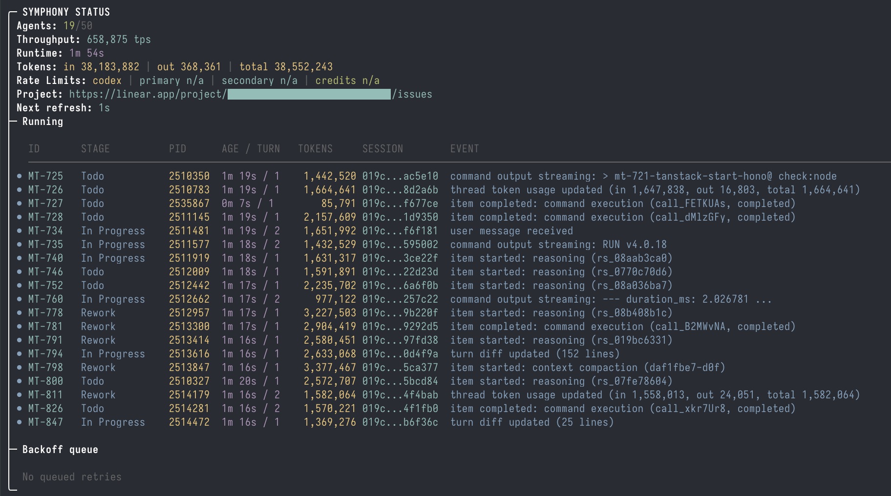

# Cymphony

> A rewrite of [openai/symphony](https://github.com/openai/symphony) that uses **Claude Code** instead of Codex as the underlying coding agent.

Cymphony turns project work into isolated, autonomous implementation runs, allowing teams to manage work instead of supervising coding agents.

## Screenshot



## Background

Cymphony is a reimagining of the original Cymphony project from OpenAI. Where Cymphony was built around OpenAI's Codex agent, Cymphony leverages Anthropic's Claude Code — offering a modern, production-ready foundation for orchestrating autonomous coding agents against your issue tracker.

## Requirements

Cymphony works best in codebases that have adopted [harness engineering](https://openai.com/index/harness-engineering/). Cymphony is the next step — moving from managing coding agents to managing work that needs to get done.

## Quick Start

### Install the CLI (macOS)

Two formulas — pick one:

```bash
brew tap zaalipro/cymphony

# Recommended: self-contained (Erlang/Elixir bundled, no system deps)
brew install cymphony

# Or: smaller binary that uses Homebrew's Elixir/Erlang
# (useful if you already have Elixir installed for other projects)
brew install cymphony-lite

cymphony
```

The two formulas conflict — install only one. Switching is just `brew uninstall <one> && brew install <other>`; your config and workspaces are untouched.

First run triggers an interactive setup (GitHub repo URL, Linear project slug, API key).

### Install the CLI (Ubuntu / Debian)

#### Prerequisites

Cymphony requires the `claude` CLI from Anthropic. Install it first if you haven't already:

```bash
# Via npm (requires Node.js 18+)
npm install -g @anthropic-ai/claude-code

# Or follow the latest instructions at:
# https://docs.anthropic.com/en/docs/agents-and-tools/claude-code/overview
```

#### Install

Download the latest `.deb` from [GitHub Releases](https://github.com/zaalipro/cymphony/releases) and install it:

```bash
# Download the latest release (amd64 only)
wget https://github.com/zaalipro/cymphony/releases/download/v0.4.2/cymphony_0.4.2_amd64.deb

# Install
sudo dpkg -i cymphony_0.4.2_amd64.deb

# Run setup
cymphony
```

First run triggers an interactive setup (GitHub repo URL, Linear project slug, API key).

#### Upgrade

```bash
wget https://github.com/zaalipro/cymphony/releases/download/v0.4.2/cymphony_0.4.2_amd64.deb
sudo dpkg -i cymphony_0.4.2_amd64.deb
```

#### Uninstall

```bash
sudo dpkg -r cymphony
```

> **Note:** The `.deb` bundles the Erlang VM, so no separate Erlang/Elixir installation is required.

### Run Commands

```bash
cymphony                       # Run with saved config
cymphony project frontend      # Run only the "frontend" project
cymphony c cz                  # Run with a different Claude provider (e.g. cz, ck, cm)
cymphony cr 3                  # Limit to 3 concurrent sessions
cymphony c cv1,cz2,ck1         # Rotate across multiple providers (round-robin random)
cymphony port 4089             # Set dashboard / HTTP server port
cymphony project AgentFarm cr 5 c cv1,cz2 port 4089  # Combine: project + concurrency + providers + dashboard
cymphony start                 # Run in background
cymphony stop                  # Stop background process
cymphony restart               # Restart background process
cymphony logs                  # Show log (use `logs 50` for last 50 lines)
cymphony setup                 # Re-run setup
cymphony add                   # Add a project
cymphony list                  # List projects
cymphony v                     # Show version
cymphony h                     # Show help
```

Flags (long form):

- `--setup` — force onboarding wizard
- `--project <name>` — run a specific project
- `--concurrency <n>` — limit concurrent Claude sessions
- `--provider <name>` — override the Claude provider for this run
- `--claude-command <cmd>` — override the Claude command for this run
- `--logs-root <path>` — override log directory
- `--port <port>` — override HTTP server port
- `--help`, `-h` — show help
- `--version` — show version

### Concurrency Control

By default Cymphony runs up to 10 concurrent Claude sessions. Use `cr N` to change this:

```bash
cymphony cr 3          # Only 3 sessions at a time
cymphony cr 1          # Run one at a time (sequential)
cymphony project backend cr 5  # 5 sessions for the "backend" project
```

How it works:

- Cymphony polls Linear for candidate issues and dispatches up to N concurrent sessions
- When a session finishes, the next waiting issue is automatically dispatched
- You can change concurrency at runtime via the dashboard or by restarting with a new `cr` value

### Provider Rotation

When running multiple concurrent sessions against the same Claude backend, you can hit rate limits. Provider rotation distributes sessions across multiple backends:

```bash
cymphony c cv1,cz2,ck1    # Use three different providers
```

How it works:

- Comma-separated provider names are parsed from the `c` command
- Each new session is randomly assigned a provider from the list
- Providers must be configured in `~/.cymphony/config.json` (see Provider Configuration below)
- Example: with `cr 6 c cv1,cz2,ck1`, you get 6 sessions randomly split across 3 providers (~2 each)

You can also change a session's provider live from the web dashboard:

1. Open the dashboard (enable with `cymphony port 4089`)
2. Find the running session card
3. Type a new provider name in the provider input field
4. Click **Set** — the session is killed and restarted with the new provider

### Provider Configuration

Cymphony supports **providers** — named environment variable sets that let you switch between Claude backends (e.g., Anthropic, Kimi, OpenRouter) without shell functions.

Providers are stored in `~/.cymphony/config.json` under the top-level `providers` key. Each provider is a name mapped to a set of environment variables that Cymphony injects when spawning Claude Code.

**Example `config.json`:**

```json
{
  "projects": [
    {
      "name": "myproject",
      "github_repo_url": "git@github.com:your-org/repo.git",
      "linear_project_slug": "yourteam-ab12cd34ef56",
      "linear_api_key": "lin_api_...",
      "claude_command": "claude",
      "provider": "cz"
    }
  ],
  "providers": {
    "cz": {
      "ANTHROPIC_BASE_URL": "https://api.z.ai/coding/v4",
      "ANTHROPIC_API_KEY": "sk-zai-...",
      "ANTHROPIC_MODEL": "glm5-.1",
      "CLAUDE_CODE_DISABLE_NONESSENTIAL_TRAFFIC": "1"
    },
    "ck": {
      "ANTHROPIC_BASE_URL": "https://api.kimi.com/coding",
      "ANTHROPIC_API_KEY": "sk-kimi-...",
      "ANTHROPIC_MODEL": "kimi-k2.6"
    }
  }
}
```

- Set `provider` on a project to use that provider by default.
- Override per-run with `cymphony c <provider>` or `cymphony --provider <name>`.
- If a provider is not found, `cymphony c <cmd>` falls back to treating it as a raw Claude command override.

Providers are configured interactively during `cymphony s` setup, or you can edit `config.json` directly.

### Reconfigure

```bash
cymphony setup
```

### Upgrade

```bash
brew upgrade zaalipro/cymphony/cymphony       # bundled
brew upgrade zaalipro/cymphony/cymphony-lite  # source-built
```

## Run from Source

We recommend using [mise](https://mise.jdx.dev/) to manage Elixir/Erlang versions.

```bash
git clone https://github.com/zaalipro/cymphony
cd cymphony
mise trust
mise install
mise exec -- mix setup
mise exec -- mix build
mise exec -- ./bin/cymphony ./WORKFLOW.md --i-understand-that-this-will-be-running-without-the-usual-guardrails
```

You can also ask your favorite coding agent to help with the setup:

> Set up Cymphony for my repository based on
> https://github.com/zaalipro/cymphony/blob/main/README.md

## How it works

1. Polls Linear for candidate work
2. Creates a workspace per issue
3. Launches Claude Code in headless mode (`claude -p`) inside the workspace
4. Sends a workflow prompt to Claude Code
5. Keeps Claude Code working on the issue until the work is done

Claude Code has built-in Read, Edit, and Bash tools. For Linear GraphQL operations, Claude Code can use `curl` directly when the `LINEAR_API_KEY` environment variable is available.

If a claimed issue moves to a terminal state (`Done`, `Closed`, `Cancelled`, or `Duplicate`), Cymphony stops the active agent for that issue and cleans up matching workspaces.

## How to use it

1. Make sure your codebase is set up to work well with agents: see [Harness engineering](https://openai.com/index/harness-engineering/).
2. Get a new personal token in Linear via Settings → Security & access → Personal API keys, and set it as the `LINEAR_API_KEY` environment variable.
3. Copy this repo's `WORKFLOW.md` to your repo.
4. Optionally copy the `commit`, `push`, `pull`, `land`, and `linear` skills to your repo.
   - The `linear` skill uses Bash `curl` for raw Linear GraphQL operations such as comment editing or upload flows.
5. Customize the copied `WORKFLOW.md` file for your project.
   - To get your project's slug, right-click the project and copy its URL. The slug is part of the URL.
   - When creating a workflow based on this repo, note that it depends on non-standard Linear issue statuses: "Rework", "Human Review", and "Merging". You can customize them in Team Settings → Workflow in Linear.
6. Follow the instructions below to install the required runtime dependencies and start the service.

## Configuration

Pass a custom workflow file path to `./bin/cymphony` when starting the service:

```bash
./bin/cymphony /path/to/custom/WORKFLOW.md
```

If no path is passed, Cymphony defaults to `./WORKFLOW.md`.

Optional flags:

- `--logs-root` tells Cymphony to write logs under a different directory (default: `./log`)
- `--port` also starts the Phoenix observability service (default: disabled)

The `WORKFLOW.md` file uses YAML front matter for configuration, plus a Markdown body used as the Claude Code session prompt.

Minimal example:

```md
---
tracker:
  kind: linear
  project_slug: "..."
workspace:
  root: ~/code/workspaces
hooks:
  after_create: |
    git clone git@github.com:your-org/your-repo.git .
agent:
  max_concurrent_agents: 10
  max_turns: 20
claude:
  command: claude -p
---

You are working on a Linear issue {{ issue.identifier }}.

Title: {{ issue.title }} Body: {{ issue.description }}
```

Notes:

- If a value is missing, defaults are used.
- Safer Claude Code defaults are used when policy fields are omitted:
  - `claude.approval_policy` defaults to `{"reject":{"sandbox_approval":true,"rules":true,"mcp_elicitations":true}}`
  - `claude.permission_mode` defaults to `acceptEdits`
  - `claude.allowed_tools` defaults to `Bash,Read,Edit`
  - `claude.thread_sandbox` defaults to `workspace-write`
- Supported `claude.approval_policy` values map to Claude Code `--permission-mode` and `--allowedTools` flags.
- Supported `claude.permission_mode` values: `acceptEdits`, `plan`, `acceptAll`.
- `agent.max_turns` caps how many back-to-back Claude Code turns Cymphony will run in a single agent invocation when a turn completes normally but the issue is still in an active state. Default: `20`.
- If the Markdown body is blank, Cymphony uses a default prompt template that includes the issue identifier, title, and body.
- Use `hooks.after_create` to bootstrap a fresh workspace. For a Git-backed repo, you can run `git clone ... .` there, along with any other setup commands you need.
- If a hook needs `mise exec` inside a freshly cloned workspace, trust the repo config and fetch the project dependencies in `hooks.after_create` before invoking `mise` later from other hooks.
- `tracker.api_key` reads from `LINEAR_API_KEY` when unset or when value is `$LINEAR_API_KEY`.
- For path values, `~` is expanded to the home directory.
- For env-backed path values, use `$VAR`. `workspace.root` resolves `$VAR` before path handling, while `claude.command` stays a shell command string and any `$VAR` expansion there happens in the launched shell.

```yaml
tracker:
  api_key: $LINEAR_API_KEY
workspace:
  root: $CYMPHONY_WORKSPACE_ROOT
hooks:
  after_create: |
    git clone --depth 1 "$SOURCE_REPO_URL" .
claude:
  command: "$CLAUDE_BIN -p --model claude-sonnet-4-6"
```

**Providers in `WORKFLOW.md`:**

When using config-based mode (`cymphony` without a `WORKFLOW.md` path), providers from `~/.cymphony/config.json` are automatically included in the generated workflow. You can also define providers directly in `WORKFLOW.md` for legacy mode:

```yaml
claude:
  command: claude
  provider: cz
providers:
  cz:
    ANTHROPIC_BASE_URL: "https://api.z.ai/coding/v4"
    ANTHROPIC_API_KEY: "sk-zai-..."
    ANTHROPIC_MODEL: "glm5-.1"
```

- If `WORKFLOW.md` is missing or has invalid YAML at startup, Cymphony does not boot.
- If a later reload fails, Cymphony keeps running with the last known good workflow and logs the reload error until the file is fixed.
- `server.port` or CLI `--port` enables the optional Phoenix LiveView dashboard and JSON API at `/`, `/api/v1/state`, `/api/v1/<issue_identifier>`, and `/api/v1/refresh`.

## Web dashboard

The observability UI runs on a minimal Phoenix stack:

- LiveView for the dashboard at `/`
- JSON API for operational debugging under `/api/v1/*`
- Bandit as the HTTP server
- Phoenix dependency static assets for the LiveView client bootstrap

### Workspace retention

Workspaces accumulate under `workspace.root` indefinitely by default — issues that close cleanly trigger a delete, but archived/abandoned ones leave their workspace behind. To enable automatic cleanup, set `workspace.retention_days` in `WORKFLOW.md`:

```yaml
workspace:
  root: ~/code/workspaces
  retention_days: 14    # delete workspaces idle for >14 days
```

Cymphony sweeps the workspace root every 6 hours, deleting only directories whose last-modified time is older than the cutoff and that aren't currently in use by a running session. The `before_remove` hook runs before each deletion. Local-only — SSH worker workspaces are not swept.

### Pause / resume

Click **Pause** in the dashboard's Polling section to stop dispatching new issues across all projects. Running sessions complete normally; queued retries wait until you click **Resume**. Each project mini-card also has its own Pause/Resume button if you only want to halt one project. Useful before deploys, during rate-limit cool-downs, or when you want to look at the dashboard without new chaos arriving.

Scriptable via the API:

```bash
curl -X POST http://localhost:4089/api/v1/pause                        # all projects
curl -X POST 'http://localhost:4089/api/v1/pause?project=AgentFarm'    # one project
curl -X POST http://localhost:4089/api/v1/resume                       # all
```

Pause state is in-memory and clears on daemon restart.

### Concurrency control

The dashboard's Polling section has a numeric input for `max_concurrent_agents`. Submitting a new value updates each running orchestrator immediately and persists to `~/.cymphony/config.json`, so it survives daemon restarts.

Scriptable via the API:

```bash
curl -X POST -H 'Content-Type: application/json' \
     -d '{"value": 5}' \
     'http://localhost:4089/api/v1/concurrency?project=AgentFarm'
```

### Per-session details

Each running session card shows the Linear issue identifier (linked to the issue), the issue title, a priority badge (Urgent/High/Medium/Low), and the current turn number — pulled from the Linear `%Issue{}` struct that's already cached on the running entry.

### Auth (optional)

By default the dashboard and API are unauthenticated — anyone with network access to the configured port can read state and trigger actions like killing a session. To require a bearer token, set `CYMPHONY_API_TOKEN` in the environment before starting the daemon:

```bash
CYMPHONY_API_TOKEN=secret123 cymphony port 4089
```

- **API**: pass `Authorization: Bearer secret123` on each request.
- **Browser**: open `http://localhost:4089/?token=secret123` once — the token is stored in the session cookie and the URL is cleaned up via redirect.
- Without the env var set, auth is disabled (backward compatible).

## Project Layout

- `lib/`: application code and Mix tasks
- `test/`: ExUnit coverage for runtime behavior
- `WORKFLOW.md`: in-repo workflow contract used by local runs
- `.claude/`: repository-local Claude Code skills and setup helpers

## Testing

```bash
make all
```

Run the real external end-to-end test only when you want Cymphony to create disposable Linear resources and launch a real `claude -p` session:

```bash
export LINEAR_API_KEY=...
make e2e
```

Optional environment variables:

- `CYMPHONY_LIVE_LINEAR_TEAM_KEY` defaults to `SYME2E`
- `CYMPHONY_LIVE_SSH_WORKER_HOSTS` uses those SSH hosts when set, as a comma-separated list

`make e2e` runs two live scenarios:

- one with a local worker
- one with SSH workers

If `CYMPHONY_LIVE_SSH_WORKER_HOSTS` is unset, the SSH scenario uses `docker compose` to start two disposable SSH workers on `localhost:<port>`. The live test generates a temporary SSH keypair, mounts the host `~/.claude/auth.json` into each worker, verifies that Cymphony can talk to them over real SSH, then runs the same orchestration flow against those worker addresses. This keeps the transport representative without depending on long-lived external machines.

Set `CYMPHONY_LIVE_SSH_WORKER_HOSTS` if you want `make e2e` to target real SSH hosts instead.

The live test creates a temporary Linear project and issue, writes a temporary `WORKFLOW.md`, runs a real agent turn, verifies the workspace side effect, requires Claude Code to comment on and close the Linear issue, then marks the project completed so the run remains visible in Linear.

## Architecture

Cymphony is composed of several key layers:

- **Workflow Loader** — Reads `WORKFLOW.md` and parses YAML front matter + prompt body
- **Config Layer** — Typed getters for workflow config with environment variable indirection
- **Orchestrator** — Poll tick, in-memory runtime state, dispatch/retry/reconciliation logic
- **Workspace Manager** — Per-issue isolated workspaces with lifecycle hooks
- **Agent Runner** — Launches Claude Code via app-server protocol over stdio
- **Issue Tracker Client** — Fetches candidates, refreshes states, normalizes payloads (Linear in this version)

### Key Features

- **Poll-based dispatch** with configurable concurrency (`cr N`) and exponential backoff retries
- **Provider rotation** (`c cv1,cz2,ck1`) to distribute sessions across multiple Claude backends and avoid rate limits
- **Per-issue workspaces** that persist across runs for deterministic behavior
- **In-repo workflow control** via `WORKFLOW.md` — version your agent prompt with your code
- **Tracker reconciliation** — stops runs when issues transition to terminal states
- **Observability** — structured logs with issue/session context

## Build Your Own

Tell your favorite coding agent to build Cymphony in a programming language of your choice:

> Implement Cymphony according to the following spec:
> https://github.com/zaalipro/cymphony/blob/main/SPEC.md

## FAQ

### Why Elixir?

Elixir is built on Erlang/BEAM/OTP, which is great for supervising long-running processes. It has an active ecosystem of tools and libraries. It also supports hot code reloading without stopping actively running subagents, which is very useful during development.

### What's the easiest way to set this up for my own codebase?

Launch `claude` in your repo, give it the URL to the Cymphony repo, and ask it to set things up for you.

## Status

> [!WARNING]
> Cymphony is a low-key engineering preview for testing in trusted environments.

## License

This project is licensed under the [Apache License 2.0](LICENSE).
